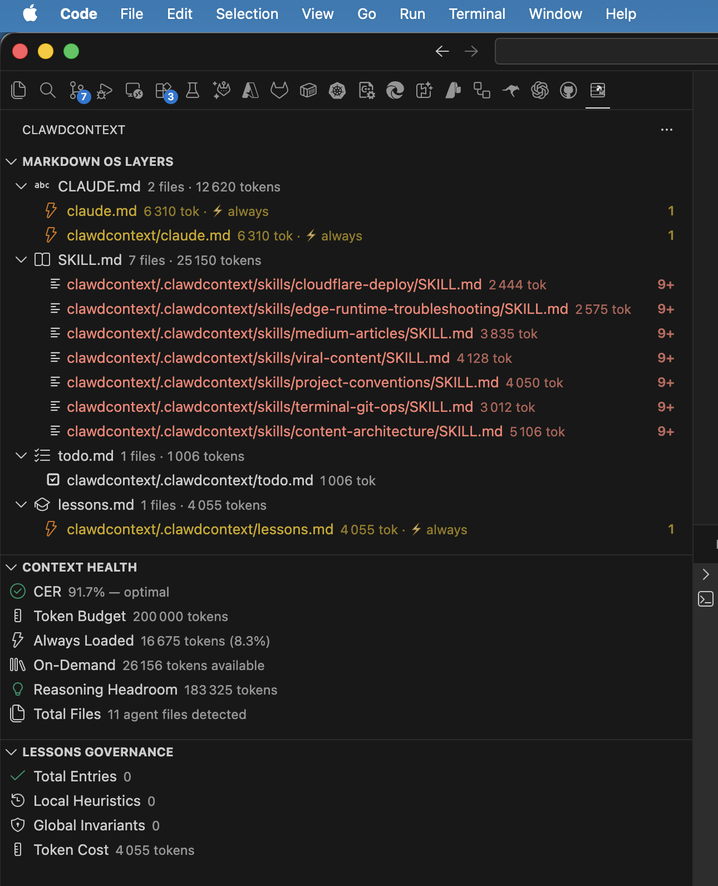
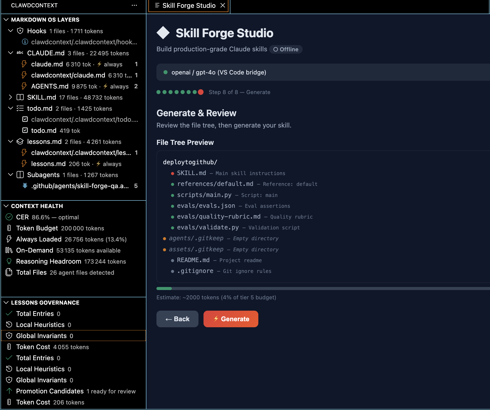
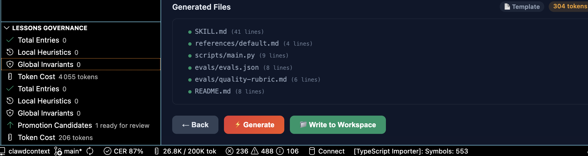
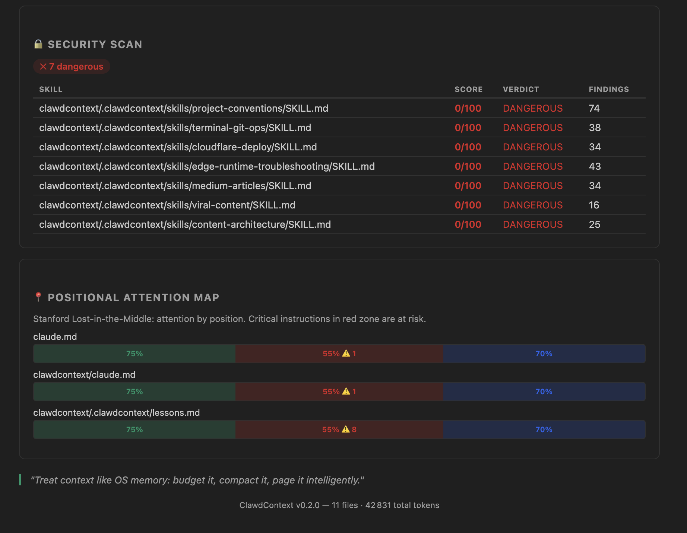
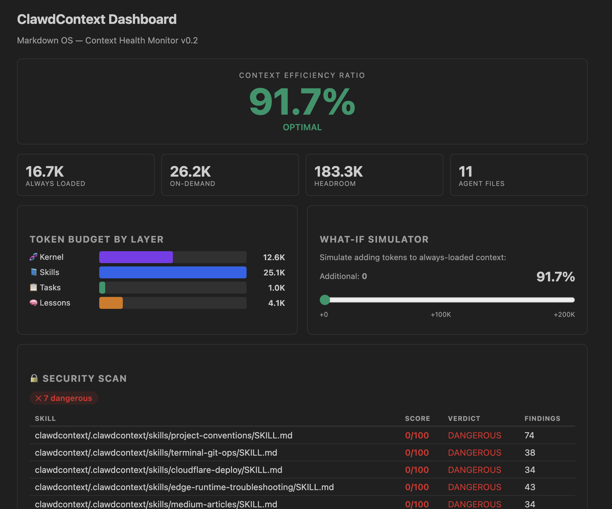

# ClawdContext — Markdown OS for AI Coding Agents

[](https://marketplace.visualstudio.com/items?itemName=clawdcontext.clawdcontext)
[](https://marketplace.visualstudio.com/items?itemName=clawdcontext.clawdcontext)
[](LICENSE)
[](https://github.com/yaamwebsolutions/clawdcontext4vscode/actions/workflows/ci.yml)
[](https://github.com/yaamwebsolutions/clawdcontext4vscode/actions/workflows/secret-scan.yml)
[](https://github.com/yaamwebsolutions/clawdcontext4vscode)
[](CONTRIBUTING.md)

**Stop prompting. Start orchestrating.**

ClawdContext is the complete VS Code toolkit for agentic AI development. It transforms your Markdown agent files into a governed operating system — combining deep **context engineering** (CER dashboard, kernel mapping, lessons lifecycle), advanced **security scanning** (SKILL.md verdicts, enterprise mTLS, strict file safety), and rich **diagnostics** (semantic contradiction detection, Lost-in-the-Middle, Kessler risk, kernel bloat analysis). **Skill Forge Studio** (built-in) guides you through creating production-quality SKILL.md files with AI-powered templates across 6 domains and 7 archetypes — online or fully offline. Works with OpenAI, Anthropic, Azure, Ollama, and DeepSeek. Every feature is designed for safe, scalable, and auditable agent workflows — governance, refactoring, and context health, all in one.

<p align="center">
  <a href="https://marketplace.visualstudio.com/items?itemName=clawdcontext.clawdcontext">
    
  </a>
</p>

<!-- Demo: Analyze Workspace → diagnostics → Quick Fix → CER dashboard update -->
<p align="center">
  
</p>

---

## What you get (in one glance)

### Core (no AI required)

- **CER Dashboard** + status bar — how much "always-loaded" context you burn vs. what's left for reasoning
- **Markdown OS Linter** — `mdcc`-style diagnostics across kernel, skills, lessons, and tasks
- **Lessons Governance** — TTL / staleness detection, metadata enforcement, prune / archive workflows
- **SKILL.md Security Scanner** — suspicious patterns + verdicts + per-skill security scores
- **Refactors & Code Actions** — extract procedure to SKILL.md, move heuristics to lessons, add missing metadata, archive deprecated entries

### Optional AI (provider required)

- Explain diagnostics, detect semantic contradictions, validate agent files, suggest refactors, deep security review
- Works with OpenAI-compatible, Anthropic-compatible, Azure OpenAI, Ollama (local), and DeepSeek-compatible providers

### Skill Forge Studio (new in 0.5.0)

- **8-step guided wizard** to create production-quality SKILL.md files from scratch
- **6 domains** (DevOps, Security, Data, Frontend, Backend, AI/ML) × **7 archetypes** (Automator, Guardian, Analyst, Builder, Optimizer, Integrator, Specialist)
- **Online mode** — run the local backend for AI-powered generation with full control and privacy
- **Offline mode** — built-in templates work without any backend or network
- **AI bridge** — automatically reuses your extension AI provider settings for the backend
- **Server lifecycle** — auto-start/stop the Python backend from within VS Code

<p align="center">
  
</p>

<p align="center">
  
</p>

### How to use Skill Forge Studio

1. Open the Command Palette (`Cmd+Shift+P` / `Ctrl+Shift+P`)
2. Run **ClawdContext: Create Skill with Skill Forge** — opens the guided wizard
3. Follow the 8-step flow: name your skill, pick a domain, choose an archetype, define scope, and generate
4. The status badge shows your current mode: **● Online** or **○ Offline**
5. The generated SKILL.md is saved to your workspace — ready to use

### Skill Forge modes explained

| Mode | Badge | Requires | Quality |
|---|---|---|---|
| **Online** | ● Online | Python backend running | AI-powered (unlimited) |
| **Offline** | ○ Offline | Nothing | Template-based |

The extension tries the local backend first. If unreachable, it falls back to offline templates. No configuration needed — it just works.

### Getting a fully working setup (5 minutes)

Skill Forge works out of the box in **Offline** mode (template-based, no setup needed). For **AI-powered** generation, follow these steps:

#### Step 1 — Configure your AI provider in VS Code

Open **Settings** (`Cmd+,` / `Ctrl+,`) and search for `clawdcontext.ai`:

| Setting | Example value |
|---|---|
| `clawdcontext.ai.provider` | `openai` (or `anthropic`, `ollama`, `deepseek`) |
| `clawdcontext.ai.apiKey` | `sk-...` (not needed for Ollama) |

This is the **only place** you configure API keys. They never leave your machine.

#### Step 2 — Start the local backend

**Requirements:** Python 3.12+

**Option A — one command** (recommended):

```bash
git clone https://github.com/yaamwebsolutions/clawdcontext.git
cd clawdcontext/skill_forge_studio
./run.sh   # macOS/Linux — creates venv, installs deps, starts on :8742
```

On Windows (PowerShell):
```powershell
git clone https://github.com/yaamwebsolutions/clawdcontext.git
cd clawdcontext\skill_forge_studio
.\run.ps1
```

**Option B — manual:**

```bash
cd clawdcontext/skill_forge_studio
python3 -m venv .venv
source .venv/bin/activate   # Windows: .venv\Scripts\activate
pip install -r requirements.txt
uvicorn backend.main:app --reload --port 8742
```

**Option C — Docker:**

```bash
cd clawdcontext/skill_forge_studio
docker compose up -d
```

#### Step 3 — Verify

```bash
curl http://localhost:8742/health
# {"status":"ok","ai_available":true,...}
```

The extension detects the backend automatically — the badge switches to **● Online**.

#### Step 4 — Create your first skill

1. `Cmd+Shift+P` → **ClawdContext: Create Skill with Skill Forge**
2. Follow the 8-step wizard: name, domain, archetype, scope, generate
3. Files are written to `.clawdcontext/skills/<name>/` in your workspace

> **How it works:** The extension forwards your AI provider settings to the local backend via the AI bridge. No `.env` file needed — VS Code settings are the single source of truth.

---

## The model: what goes where

| File | Role |
|---|---|
| **CLAUDE.md / AGENTS.md** | Kernel: invariants, non-negotiables, short checklists |
| **SKILL.md** | On-demand procedures (reusable workflows, playbooks) |
| **todo.md** | Local task state (plan, constraints, done criteria) |
| **lessons.md** | Governed learning cache (verified lessons + metadata + TTL) |

---

## In 60 seconds

1. Open a repo containing any of: `CLAUDE.md`, `AGENTS.md`, `SKILL.md`, `lessons.md`, `todo.md`
2. Run **ClawdContext: Analyze Workspace**
3. Open **ClawdContext: Open Dashboard** and apply **quick fixes** from diagnostics
4. New repo? Run **ClawdContext: Scaffold Markdown OS Templates**

<p align="center">
  
</p>

---

## Diagnostics you'll actually see

- `CER_CRITICAL` · `CER_WARNING`
- `KERNEL_BLOAT` · `PROCEDURE_IN_KERNEL` · `HEURISTIC_IN_KERNEL`
- `KESSLER_RISK` · `STALE_LESSON` · `MISSING_METADATA` · `DEPRECATED_PRESENT`
- `SKILL_NO_FRONTMATTER` · `SKILL_TOO_LARGE`
- `CONTRADICTION` · `LOST_IN_MIDDLE`

Each diagnostic comes with a **quick-fix code action** when applicable.

---

## Best commands (the 8 you'll use daily)

| Command | What it does |
|---|---|
| **Analyze Workspace** | Full scan — tokens, CER, diagnostics, security |
| **Open Dashboard** | Interactive CER dashboard with layer breakdown |
| **Lint .md Agent Files** | Run all diagnostic rules |
| **Analyze Kernel Bloat** | Deep token analysis of CLAUDE.md |
| **Extract Procedure to SKILL.md** | Refactor procedure from kernel to skill |
| **Move Heuristic to lessons.md** | Move temporal heuristic from kernel |
| **Prune Stale Lessons** | Archive lessons past TTL |
| **Archive Deprecated Entries** | Clean dead rules |

15 core commands + 11 AI commands + 4 OS/Skill Forge commands — 30 total. [Full command list →](https://github.com/yaamwebsolutions/clawdcontext4vscode#best-commands-the-8-youll-use-daily)

---

## Safe-by-design write behavior

When AI is enabled, ClawdContext applies strict safety constraints:

- File paths validated via `sanitizePath()` — path traversal blocked (`../`, absolute paths)
- Only `.md` and `.json` files can be written
- **User confirmation required** before any file write
- Enterprise: mTLS client certs + custom CA + Azure OpenAI deployments

---

## Privacy: what leaves your machine

| Scenario | Data sent |
|---|---|
| **No AI provider configured** | Nothing. Zero network calls. 100% offline. |
| **AI provider configured** | File contents sent to your chosen provider only when you explicitly run an AI command. |

No telemetry. No analytics. No tracking.

---

## Minimal settings (start here)

| Setting | Default | What it controls |
|---|---|---|
| `clawdcontext.tokenBudget` | `200000` | Your model's context window size |
| `clawdcontext.cerWarningThreshold` | `0.4` | CER below this → warning |
| `clawdcontext.cerCriticalThreshold` | `0.2` | CER below this → critical |
| `clawdcontext.lessonsTtlDays` | `60` | Days before a lesson is stale |
| `clawdcontext.lessonsMaxEntries` | `50` | Max lessons before Kessler risk |

**Skill Forge** (new in 0.5.0):

| Setting | Default | What it controls |
|---|---|---|
| `clawdcontext.skillForge.serverUrl` | `http://localhost:8742` | Skill Forge Studio backend URL |
| `clawdcontext.skillForge.apiKey` | *(empty)* | API key for the backend (if protected) |
| `clawdcontext.skillForge.generateTimeout` | `180` | Timeout in seconds for AI skill generation (30–600) |
| `clawdcontext.skillForge.autoStart` | `false` | Auto-start the Python backend on activation |

All settings: [full configuration reference →](https://github.com/yaamwebsolutions/clawdcontext4vscode#minimal-settings-start-here)

---

## Install

```bash
code --install-extension clawdcontext.clawdcontext
```

Or search **"ClawdContext"** in the Extensions panel (`Ctrl+Shift+X` / `Cmd+Shift+X`).

<p align="center">
  
</p>

---

## What ClawdContext is / is not

| ClawdContext **is** | ClawdContext **is not** |
|---|---|
| Analyzer + governance + context health | A replacement for hooks / tests / CI gates |
| Refactoring assistant for kernel vs. skills | An execution sandbox |
| CER monitor + lessons lifecycle | A full policy engine |

---

## Docs / Research

- [Your AI Agent Has 200K Tokens of RAM — And You're Wasting 80% of It](https://clawdcontext.com/en/blog/ai-agent-200k-tokens-ram-wasting-80-percent)
- [AGENTS.md evaluation paper (arXiv)](https://arxiv.org/abs/2602.11988)
- [SkillsBench (arXiv)](https://arxiv.org/abs/2602.12670)

---

## Development

```bash
git clone https://github.com/yaamwebsolutions/clawdcontext4vscode.git
cd clawdcontext4vscode
npm install
npm run compile
```

Press `F5` in VS Code to launch the Extension Development Host.

## Contributing

We welcome contributions! See [CONTRIBUTING.md](CONTRIBUTING.md) for guidelines.

- [CODE_OF_CONDUCT.md](CODE_OF_CONDUCT.md) · [SECURITY.md](SECURITY.md) · [SUPPORT.md](SUPPORT.md) · [ROADMAP.md](ROADMAP.md)

## Star History

<a href="https://star-history.com/#yaamwebsolutions/clawdcontext4vscode&Date">
  <picture>
    <source media="(prefers-color-scheme: dark)" srcset="https://api.star-history.com/svg?repos=yaamwebsolutions/clawdcontext4vscode&type=Date&theme=dark" />
    <source media="(prefers-color-scheme: light)" srcset="https://api.star-history.com/svg?repos=yaamwebsolutions/clawdcontext4vscode&type=Date" />
    
  </picture>
</a>

## License

[MIT](LICENSE)

---

**[Yaam Web Solutions](https://clawdcontext.com)**

[Install](https://marketplace.visualstudio.com/items?itemName=clawdcontext.clawdcontext) · [Report Issues](https://github.com/yaamwebsolutions/clawdcontext4vscode/issues) · [Discussions](https://github.com/yaamwebsolutions/clawdcontext4vscode/discussions)
